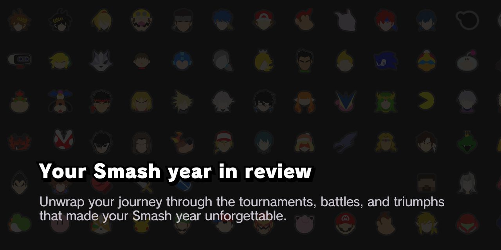

> **Try it out live:** [smashers-wrapped.vercel.app](https://smashers-wrapped.vercel.app)

A platform that generates a year-in-review video for each [start.gg](start.gg) user. Built with Sveltekit.

---

## Statistics

### 📊 Stats générales

- [x] Nombre total de tournois joués
- [x] Nombre de matchs disputés
- [x] Winrate global (%)
- [x] Nombre total de sets gagnés/perdus
- [x] Personnages joués les plus fréquents
- [x] Maps jouées les plus fréquentes
- [x] Nombre de X-O's réalisés et reçus

### 🏆 Performances par tournoi

- [ ] Meilleure performance (place la plus haute)
- [x] Tournois avec le plus grand nombre de participants
- [ ] Nombre de Top 8 / Top 16 / sorties de pools
- [ ] Tournoi le plus fréquenté où le joueur a battu un seed plus élevé

### ⚔️ Rivalités et adversaires

- [ ] Adversaire affronté le plus souvent
- [ ] Joueurs contre qui il/elle a le meilleur/mauvais ratio
- [ ] Upsets réalisés (victoires contre joueurs mieux seedés)
- [ ] Nombre de fois éliminé par le même joueur

### 🎖️ Badges et fun stats

- [ ] "ThroneBreaker": won against the highest seed in the tournament
- [ ] "Back from the dead": won a tournament after being sent to loser bracket
- [ ] "Upset King": beat a higher seeded player multiple times
- [ ] "Defender": beat all lower seeded players / never lost to a lower seed
- [ ] "Top 8 finisher": finished in tournament top 8 multiple times
- [ ] "The Comeback kid": won after being down 2-0 multiple times
- [ ] "The Regular": played multiple tournaments in the same venue
- [ ] "The Underdog": won a tournament with a seed of 9 or higher
- [ ] "Globetrotter": played in multiple countries
