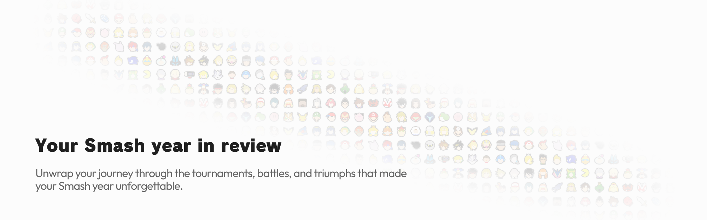

<a href="#">
	<picture>
		<source media="(prefers-color-scheme: dark)" srcset="assets/banner_dark.png">
		
	</picture>
</a>

## What is SmashRecap

SmashRecap is a platform that generates a personalized year-in-review video for each [start.gg](https://start.gg/) Super Smash Bros. Ultimate player.
